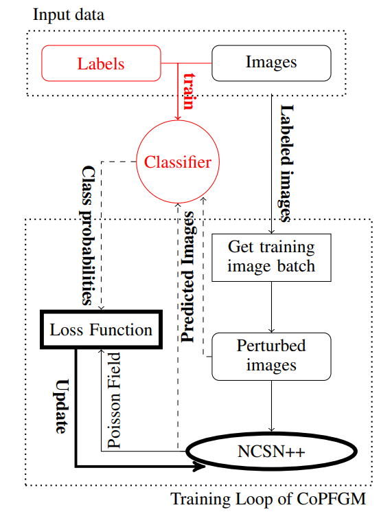
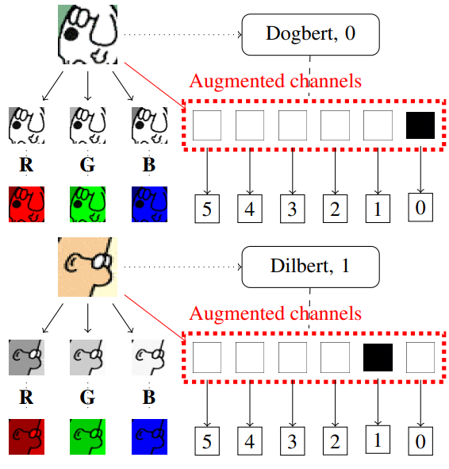

# Conditional Poisson Flow Generative Models

Pytorch implementation of the CoPFGM 2023 paper [include paper link]

by [Ioannis Georgiades]()

we provide a notebook, that was created on Colab, please adjust the
CUDA settings and Python version to match the projects requirements.

[](Conditional_Poisson_Flow.ipynb)
---

We propose a new **Conditional** Poisson flow generative model (**CoPFGM**) that extends the PFGM [repository](https://github.com/Newbeeer/Poisson_flow) and allows for conditional image sampling, provided proper label
dataset and configured model. Currently the repository supports the following datasets:

* **MNIST** : Common dataset of handwritten digits provided by Tensorflow Datasets
* **Dilbert - Faces** : Custom dataset of Dilbert comic strips faces. Dataset not publicly available. But the model to generate is provided.


Experimentally, CoPFGM achieves the conditional behavior by introducing the
label information of each image during training and sampling by augmenting 
the class information to the color channels themselves, and enhancing the
sampling wquality with an updated loss function that uses the Cross Entropy Loss of the images during training.

<left></left>
<right></right>


---


*Acknowledgement:* Our implementation relies on the repo [Poisson Flow Generative Models](https://github.com/Newbeeer/Poisson_flow)


## Dependencies

The code is tested on Ubuntu 20.04,
Python 3.10.12, CUDA Version 11.8

```sh
pip install -r requirements.txt
```


## Usage

Train and evaluate our models through `main.py`.

```sh
python3 main.py:
  --config: Training configuration.
  --eval_folder: The folder name for storing evaluation results
    (default: 'eval')
  --mode: <train|eval>: Running mode: train or eval
  --workdir: Working directory
```

For example, to train a new CoPFGM model on MNIST dataset, one could execute 

```sh
python3 main.py --config ./configs/poisson/mnist_config.py --mode train \
--workdir CoPFGM_MNIST
```

And similarly, to evaluate the model, one could execute

```sh
python3 main.py --config ./configs/poisson/faces_config.py --mode train \
--workdir CoPFGM_Dilbert
```
  **Note**: During training and sampling the default conditioned class is
  the first class of the dataset for example the number 0 for MNIST. To change the conditioned class, please
  modify the `config.sampling.target` parameter in the config files or
  modify the command by adding `--config.sampling.target [ClassID]`.

 `config` is the path to the config file. The prescribed config files are provided in `configs/`. They are formatted according to [`ml_collections`](https://github.com/google/ml_collections) and should be quite self-explanatory.

For a custom dataset, you can run the following script, which will
give you some PFGM hyper-parameter suggestions, based on the average data norm of the dataset and the data dimension: 

```shell
python3 hyper-parameters.py 
  --data_norm: Average data norm of the dataset 
  --data_dim: Data dimension
```


*  `workdir` is the path that stores all artifacts of one experiment, like checkpoints, samples, and evaluation results.

* `eval_folder` is the name of a subfolder in `workdir` that stores all artifacts of the evaluation process, like meta checkpoints for pre-emption prevention, image samples, and numpy dumps of quantitative results.

* `mode` is either "train" or "eval". When set to "train", it starts the training of a new model, or resumes the training of an old model if its meta-checkpoints (for resuming running after pre-emption in a cloud environment) exist in `workdir/checkpoints-meta` .


## Tips

- **Important** : We use a large batch (e.g. current `training.batch_size=4096` for MNIST) to calculate the Poisson field for each mini-batch samples (e.g. `training.small_batch_size=128` for MNIST). To adjust GPU memory cost, please modify the `training.batch_size` parameter in the config files. The same applies for the dilbert dataset.
  

## Checkpoints

Please place the pretrained checkpoints under the directory `workdir/checkpoints`, e.g., `CoPFGM_MNIST/checkpoints` or use the provided Colab notebook to fetch them.

To generate and evaluate the FID/IS of  (10k) samples of the CoPFGM you could execute:

```shell
python3 main.py --config ./configs/poisson/mnist_config.py --mode eval \ 
--workdir CoPFGM_MNIST --config.eval.enable_sampling --config.eval.num_samples 10000
```

To only generate and visualize 100 samples you could execute:

```shell
python3 main.py --config ./configs/poisson/mnist_config.py --mode eval \ 
--workdir CoPFGM_MNIST --config.eval.enable_sampling --config.eval.save_images --config.eval.batch_size 100
```

The samples will be saved to `CoPFGM_MNIST/eval/ode_images_{ckpt}.png`.

Important, depending on the config and chekpoint counter, you might need 
to adjust also in the config the 

```shell
... --config.eval.begin_ckpt x --config.eval.end_ckpt y
```

| Dataset              | Checkpoint path                                                   |  IS  |  FID  | NFE (RK45) |
| -------------------- | :----------------------------------------------------------- | :----------------: | :--:  | :--------: |
| MNIST| [`poisson/pretrained_mnist/`](https://drive.google.com/file/d/1Ei2r1r9Tu0iFUTXMmgYhadXhTwhOlqhK/view?usp=sharing) | 1.79 | 313.64  |    ~104    |
| Dilbert| [`poisson/pretrained_dilbert/`](https://drive.google.com/file/d/1vgxw1zRrG6jAQIJj02WOGahCcJPWMbHk/view?usp=sharing) | 2.59 | 149.30  |    ~122    |


## FID statistics

Please find the statistics for FID scores in the following links and save them under assets folder, or use the provided Colab notebook to fetch them.

[Dilbert](https://drive.google.com/file/d/1Q6tQ7sSpGLEL7lwnkX2ThMr84ws5vyC3/view?usp=sharing),  [MNIST](https://drive.google.com/file/d/1hecVSJMK0Ga4kbjdw0rkiJ3p-MX6Lnlk/view?usp=sharing)

## Dilbert Dataset (ONLY FOR THESIS COMMITTEE)

They are also provided in the repository, but here are the external links for the Dilbert dataset.

[Images](https://drive.google.com/drive/folders/1cye_l2ultb34WQuvwiYHeSn_1RHZnjJ0?usp=sharing) ,
[Labels](https://drive.google.com/file/d/10rW25jGSx4bpKy-V_bMdEQAP8xjarVTV/view?usp=sharing)

And again put the entire folder and the csv file under the assets folder. Or
use the provided Colab notebook to fetch them.
## Results

<center></center>
<center></center>


